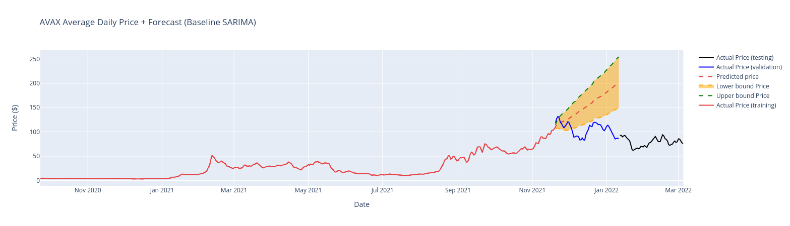

# avax-project

This repository contains a notebook (avax-price-forecast.ipynb) for tracking the price of the cryptocurrency Avax of the Avalanche network.
- Summary:
  - The goal of this project was to develop a model that could be used to predict the price of Avax in the future. 
  - Predicting the price of commodities is a very valuable tool for investors, but it is not always possible to predict the price of a commodity in advance.
  - Just by observation of the SARIMA Forecast plots, the forecasts performs better in earlier in the forecast than in the longterm.
  - Also by observation, the LSTM model performs better in the longterm than the SARIMA model.
  - The LSTM model also performed better than the SARIMA model overall based on the lower MSE value for validation and tests sets.
  - The model is not perfect, but it is a good starting point for something more sophisticated.

Screenshot of the daily price history with the 30 day forecast after the black vertical line:

